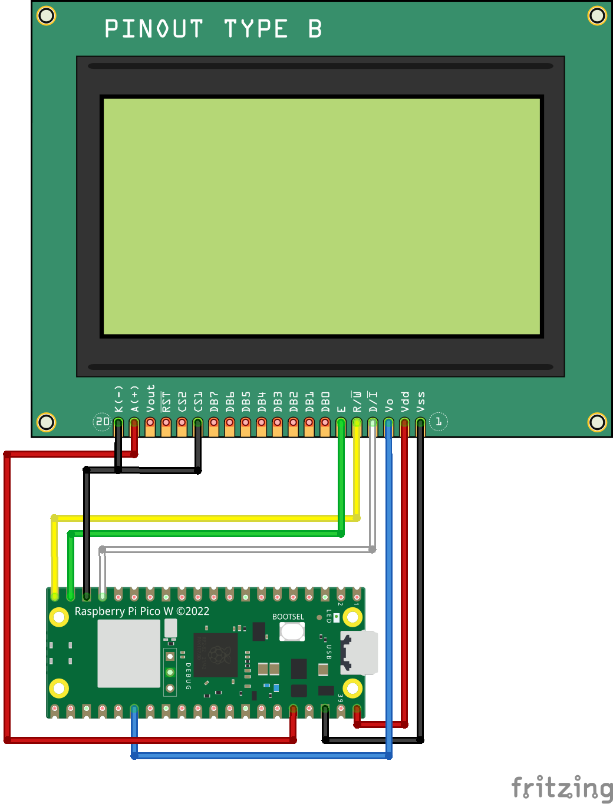
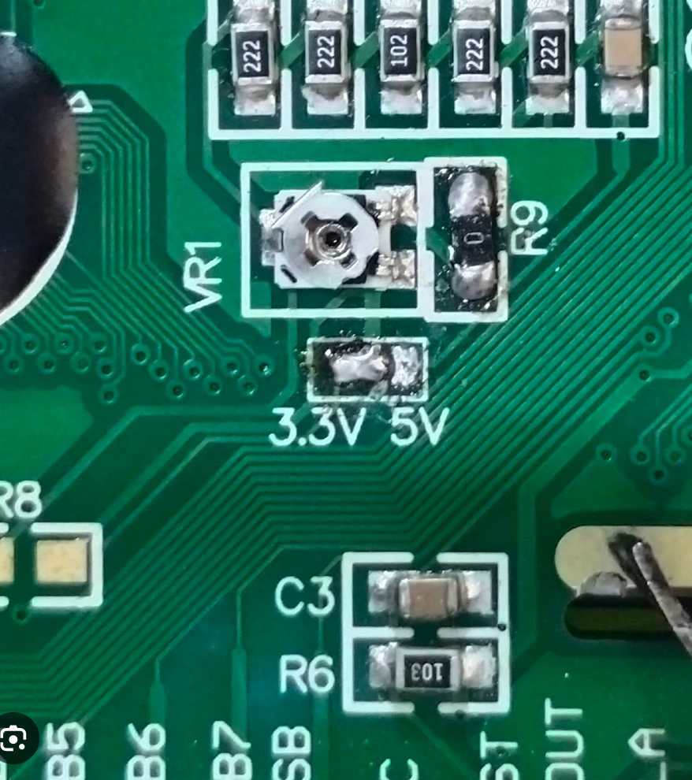

# pico_st7920

As I have searched for hours about how to get this display running on a raspberry pi pico
I finally managed to get it working.

<h3>Pinout</h3>

| Pin Display | Pin Pico | Remark                   |
|-------------|----------|--------------------------|
| 1 GND       | GND      |                          |
| 2 VCC       | VBUS     | My Version has a 3V/5V selector set to 5V         |
| 3 VO        | GP26     |                          |
| 4 RS        | GP13     | SPI CS                   |
| 5 R/W       | GP15     | SPI TX                   |
| 6 E         | GP14     | SPI SCK                  |
| 15 PSB      | GND      | ParallelSerialBus selector  GND = Serial  High= Parallel                      |
| 19 BLA      | 3v3      |                          |
| 20 BLK      | GND      |                          |
|             |          |                          |

<h3>3V/5V Selector 

 

<h3>Example </h3>

    # imports
    from machine import SPI, Pin
    from st7920 import ST7920

    # define pins
    pin_spi = 14
    pin_mosi = 15
    pin_cs = 13

    # init
    spi = SPI(1, baudrate=1_000_000, sck=Pin(pin_spi), mosi=Pin(pin_mosi))
    cs = Pin(pin_cs, Pin.OUT, value=0)
    fbuf = ST7920(spi, cs)

    # print spi info
    print(fbuf._spi)

    # display stuff
    fbuf.fill(0)
    fbuf.ellipse(64, 31, 10, 10, 1, True)
    fbuf.ellipse(64, 31, 5, 5, 0, True)
    fbuf.text('Hello World!', 0, 0, 0xffff)
    fbuf.show()
</code>
